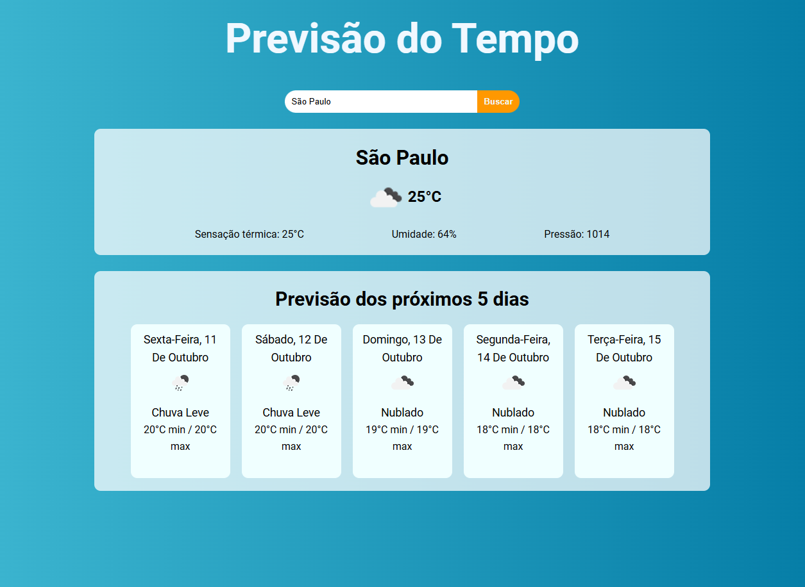

# Weather App

## Descrição
Este projeto é uma aplicação de previsão do tempo, desenvolvida utilizando **HTML**, **CSS**, **JavaScript**, **React** e **Vite**. Ele permite que o usuário pesquise o clima de qualquer cidade, exibindo informações como temperatura atual, sensação térmica, umidade, além de uma previsão para os próximos cinco dias. A aplicação faz uso da API **OpenWeatherMap** para obter os dados em tempo real.

## Funcionalidades
- Pesquisar a previsão do tempo de qualquer cidade.
- Exibir temperatura atual, umidade e sensação térmica.
- Previsão estendida para os próximos cinco dias.
- Interface simples e interativa, desenvolvida com componentes React.

## Tecnologias Utilizadas
- **HTML5**
- **CSS3**
- **JavaScript (ES6+)**
- **React** 
- **Vite**
- **Axios** (para requisições HTTP)
- **OpenWeatherMap API**

  
